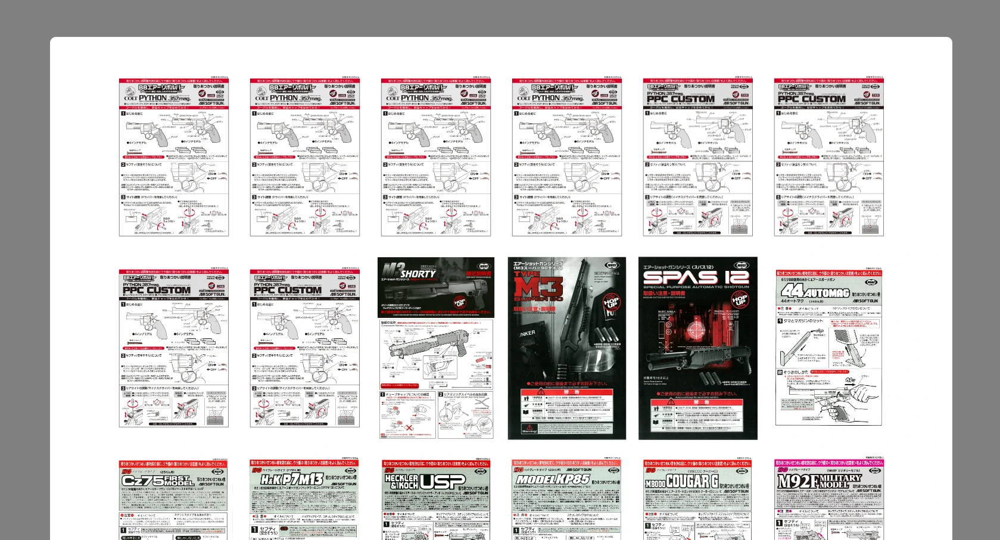

# 東京マルイ製品情報自動収集ツール
東京マルイのウェブサイトにある製品情報を集めるツールです。  
**Webクローラー研究用、悪用厳禁！**  
## 主な機能
### get_all_products.py  
製品名、価額、カテゴリー、ID、URLを自動的に収集し、CSVファイルを作成します。  
### get_all_instruction_manuals.py  
すべての製品の取扱い説明書を自動的にダウンロードします。インターネットがなくてもご覧することが可能になりました。  
### 取扱い説明書一覧.html
  
## 使い方
0. Pythonをインストール
1. `インストール.cmd`を実行（Pythonの仮想環境を自動的に作成）
2. `オートスタート.cmd`を実行（`get_all_products.py`、`get_all_instruction_manuals.py`、`get_cover_image.py`の順に実行、最後に`取扱い説明書一覧.html`を開く） 